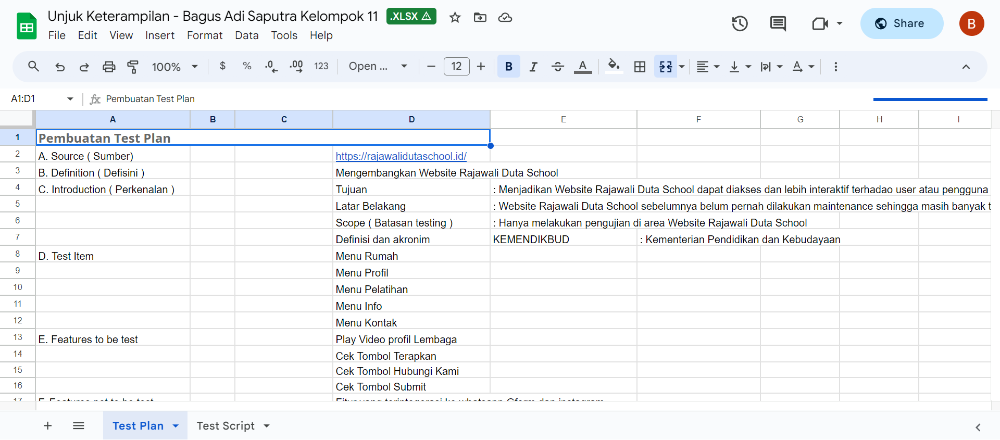
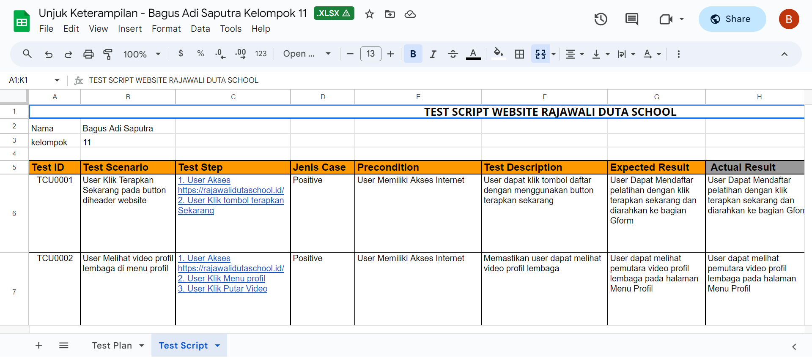

# Quality Assurance untuk Pengembangan Perangkat Lunak - Rajawali Duta School x Karier.mu

Melakukan uji kualitas pada website : https://rajawalidutaschool.id/ ,kemudian membuat:
- Test plan, Test Skenario, dan Test Script ke dalam bentuk Google Spreadsheet
- Mencatat dan melaporkan temuan bug dengan melampirkan Screenshot hasil temuan  ke dalam bentuk Google Spreadsheet
- Membuat Dokumentasi hasil pengujian ke dalam bentuk Google Docs
 

### Software tool:

- Microsoft Excel
- Google Spreadsheet
- Google Docs
- Google Chrome

### Link Project:

https://drive.google.com/drive/folders/1Sj-znMfHe_enE9PXQxhAa71TaLTxW5Rl?usp=sharing

### Link certificate:

https://app.karier.mu/sertifikat/11394150?

# Preview

### Screenshot

### Melakukan uji kualitas pada website : https://rajawalidutaschool.id/

### Test plan

### Test Script

### Test Skenario

